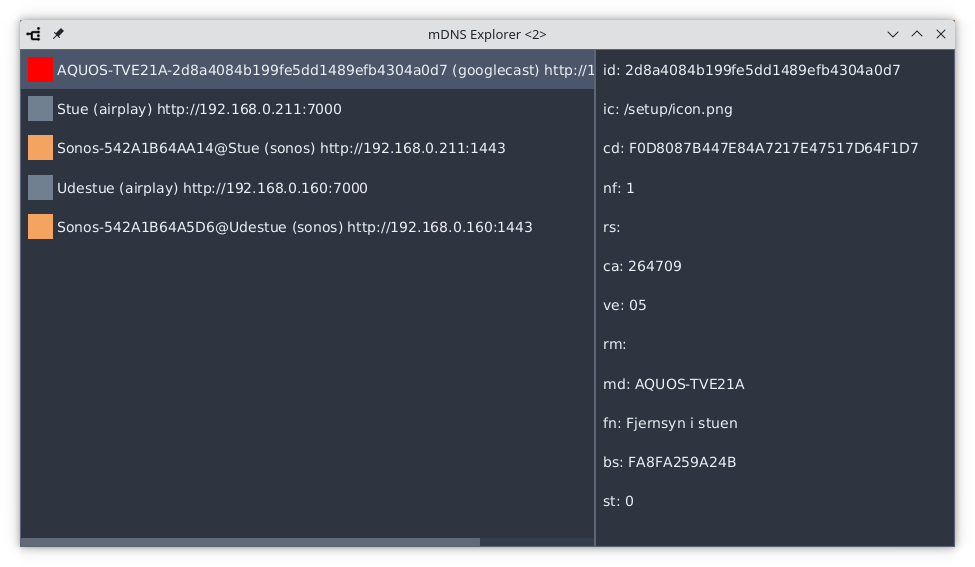

# mDNS Explorer

See devices on your local network that advertises services through mDNS (multicast DNS).



When selecting an entry from the list:
- the service URL is copied to your clipboard
- and you will see any properties from the selected service

Download installers for Windows, macOS & Linux [here](https://github.com/mnellemann/mdns-explorer/releases).


## Development

Java SDK version 17 (or later) is required.

Information on how to build and package mDNS-Explorer:

```shell
./gradlew build jpackage
```

### Windows

Download and install:

- Microsoft .NET Framework 3.5
- Wix Toolset 3.11.2 (or later)


### Linux

On Debian/Ubuntu:

- ```apt install dpkg-dev rpm```


### MacOS

Install xcode command line tools:

- ```xcode-select --install```

